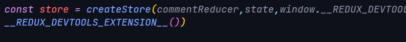

# redux
## This is my first project in react-redux

# Как работает мое приложение

Стараюсь описать все в мельчайших аспектах, не пропустив вообще ничего. Ну или пропущу незначительные вещи,но про redux расскажу подробно

### Инициализация хранилища(store)

перед этим всем делом импортируем нужные нам функции и т.д.

## Ответы на вопросы
### Что делает Redux и какие проблемы он решает
Redux помогает управлять состоянием приложения, которые ведут себя предсказуемо, ну или же однотипно.

Redux решает следующие проблемы:

* Когда наше приложение разрастается и усложняется его бизнес-логика, становится трудно хранить состояние в корневом компоненте и передавать его дочерним. 

Redux позволяет соединить наши компоненты и разделить их на:smart & dumb (хотя это можно было и в реакте реализовать, но узнал об этом только сейчас). Уже потом мы можем передать "умным" компонентам наши данные и "глупые" сделают всю грязную работу за них. 
***
### Однонаправленный поток данных

Одним их хороших примеров: баг с уведомлениями в Facebook.

Проблему описывать я не стану, но разработчики предложили выход из этого порочного круга, представив новый тип архитектуры передачи (????или как это назвать????) данных. Они назвали эту архитектуру Flux. Вообще Facebook молодцы, столько всякого придумали, но свою соц.сеть нормально сделать не смогли. Чисто мое мнение

[вот схема управления данными](https://miro.medium.com/max/875/1*lZM0yU9ExEMd7DggVxXkxA.png)

Независимо от размера приложения, Redux всегда является единственным объектом, в отличие от Flux, который содержит различные хранилища для разных объектов. Если в данных были сделаны изменения, это не влияет непосредственно на состояние. Таким образом, state является неизменным.

********************************

### Как организован dataFlow in Redux

* Мы вызываем dispatch который принимает в себя action. Action - это простой JS объект, который описывает что же произошло на данный момент. Например:

        { type: 'LIKE_ARTICLE', articleId: 42 }

* Redux-стор вызывает функцию-редьюсер, который мы ему передали.Стор передаст два аргумента при вызове редьюсера: текущее дерево состояния (current state tree) и экшен (action). Еще важно отметить, что reducer - это чистая функция, которая совершенно предсказуема.

    // Текущее состояние приложения (список дел и выбранный фильтр)

        let previousState = {

            visibleTodoFilter: 'SHOW_ALL',
            todos: [ 
                {
                    text: 'Read the docs.',
                    complete: false
                }
            ]
        }

    // Выполнение экшена (добавление дела)

        let action = {
        type: 'ADD_TODO',
        text: 'Understand the flow.'
        }

    // редюсер возвращает следующее состояние приложения

        let nextState = todoApp(previousState, action)

* Главный редьюсер может комбинировать результат работы нескольких редьюсеров в единственное дерево состояния приложения. Сделать мы можем это при помощи combineReducers(); 

* И уже наконец наш стор сохраняет в себе результат выполнения редьюсеров
********************************
### Взаимодействие частей Redux
* Функция createStore()
Создает стор в нашем приложении, которое должно быть одним единственным в нашем приложении. Входные параметры:
    * reducer. Функция редьюсера, которое возвращает следующее состояние и action к обработке этого события
Возвращает же он стор. Это объект, который содержит полное состояние нашего приложения. Единственный способ его изменить - отправка экшенов

* store.getState() - возвращает текущее состояние дерева приложения. Он равен последнему значению, который вернул редьюсер.
store.dispatch(action) - отправляет наше действие. Это единственный способ изменить состояние приложения

    store.dispatch(addTodo('Read the docs'))

    const store = createStore(todos, ['Use Redux'])

    function addTodo(text) {
        return {
        type: 'ADD_TODO',
        text
        }
    }
store.subscribe(listener) - Данный метод принимает функцию, которая будет вызывается каждый раз после обновления store. Он как бы «подписывает» функцию, переданную ему на обновление. 

    const unsubscribe = store.subscribe(handleChange)

Я взял примеры из документации, они простые и понятные, я думаю, это не столь критично)

* Экшены - это объекты, которые передают информацию в стор приложения

        const ADD_TODO = 'ADD_TODO'

        {
            type: ADD_TODO,
            text: 'Build my first Redux app'
        }
Экшены — это обычные JavaScript-объекты. Экшены должны иметь поле type, которое указывает на тип исполняемого экшена. Типы должны быть, как правило, заданы, как строковые константы

* Генераторы экшенов (Action Creators) — не что иное, как функции, которые создают экшены.

        function addTodo(text) {
            return {
                type: ADD_TODO,
                text
            }
        }

Это делает их более переносимыми и легкими для тестирования. Других причин, почему нельзя создавать экшены руками не нашел, но думаю, что через функции будет куда удобнее поддерживать и изменять.

* Функция редьюсер
>Actions описывает факт, что что-то произошло, но не указывает, как состояние приложения должно измениться в ответ, это работа для Reducer'а" - [(офф. документация)](https://redux.js.org/tutorials/fundamentals/part-3-state-actions-reducers)

    (currentState, action) => newState

Чистая функция работает независимо от состояния программы и выдаёт выходное значение, принимая входное и не меняя ничего в нём и в остальной программе. Получается, что редьюсер возвращает совершенно новый объект дерева состояний, которым заменяется предыдущий.

Редьюсер не должен:
- изменять аргументы
- изменять состояние. Вместо этого создается новое состояние с помощью спред-оператора (или как он там пишется):

        function todosReducer(state, action) {
            switch (action.type) {
            case 'ADD_TODO':
                return [
                    ...state,
                    {
                        id: action.id,
                        text: action.text,
                        completed: false
                    }
                ]

Это опять же пример из документации. В редьюсер мы передаем наше текущее состояние и экшн, используя конструкцию switch перебираем наши кейсы, если кейс оказался успешным, то возвращаем наше прошлое состояние и новый объект в нем, тем самым делая новое состояние приложения. Может быть я плохо объяснил?)

* Функция dispatcher
Отправляет экшен. Это единственный способ изменить состояние.

#### Параметры

- action : Простой объект описывающий изменения, которые имеют смысл для вашего приложения. Экшен являются единственным способом получения данных из стора, т.ч. любые данные.
